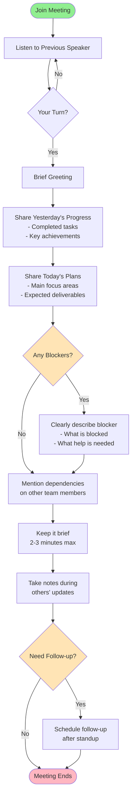

# Meeting Mind Flow 🎤💭

A comprehensive guide to effective communication in tech company meetings. This project provides structured speaking flows and natural expressions to help you communicate confidently and professionally in various meeting scenarios.

## 📋 Overview

Meeting Mind Flow is a practical resource for software engineers and tech professionals who want to improve their communication skills in workplace meetings. It provides:

- **Visual flowcharts** showing the natural progression of communication in different meeting types
- **Ready-to-use expressions** for each step of the conversation
- **Natural, conversational language** that sounds professional yet approachable

## 🎯 What's Inside

### Meeting Types Covered

1. **Daily Stand-up Meeting** (Attendee)
2. **Weekly Stand-up Meeting** (Attendee)
3. **Knowledge Sharing Meeting** (Facilitator/Chair)
4. **Technical Meeting / Code Review** (Presenter/Communicator)


## 🚀 How to Run

This project includes an automated script to generate customized coordinator documents based on your job role, experience, and company.

### Prerequisites
- Python 3.10 or higher
- [GitHub Copilot CLI](https://docs.github.com/en/copilot/concepts/agents/about-copilot-cli)

### Quick Start

1. **Clone the repository:**
   ```bash
   git clone <repository-url>
   cd Efficient-communication-at-workplace
   ```

2. **Run the automation script:**
   ```bash
   chmod +x run.sh
   ./run.sh --job "Software Engineer" --yoe 5 --company "Google"
   ```

3. **Customize with different parameters:**
   ```bash
   # Specify AI model (default: gpt-5)
   ./run.sh --model "claude-sonnet-4" --job "Machine Learning Engineer" --yoe 3 --company "OpenAI"
   
   # Use different job titles (underscores or dashes work)
   ./run.sh --job "Senior Data Scientist" --yoe 8 --company "Meta"
   ```

## 📖 How to Use the Resources

### For Visual Learners
1. Open `examples/task-stage-1-output.md` to view the Mermaid flowcharts
2. Follow the flow diagram for your meeting type
3. Use the color-coded nodes to understand decision points and actions

### For Expression Reference
1. Open `examples/task-stage-2-output.md` to browse ready-to-use expressions
2. Find your meeting type and specific speaking step
3. Choose an expression that fits your situation and personal style

### Color Legend in Diagrams
- 🟢 **Green nodes**: Start of the flow
- 🩷 **Pink nodes**: End of the flow
- 🟡 **Yellow nodes**: Decision points requiring judgment
- 🔵 **Blue nodes**: Regular action steps (speaking points)

## 💡 Key Features

### Natural & Conversational
All expressions are designed to sound like real tech professionals speaking, not corporate robots:
- Uses contractions and natural fillers
- Includes thought processes ("I think...", "Maybe...")
- Balances professionalism with approachability

### Versatile Options
Each speaking step includes 5 different expressions, giving you:
- Flexibility to match your personal style
- Options for different contexts and moods
- Variety to avoid sounding repetitive

## 📊 Example: Daily Stand-up Meeting

Here's a complete example showing both the communication flow and ready-to-use expressions for a daily stand-up meeting.

### Flow Diagram



### Sample Expressions

#### 1. Brief Greeting
- "Hey everyone, good morning!"
- "Morning all!"
- "Hey team, how's it going?"

#### 2. Share Yesterday's Progress
- "So yesterday I wrapped up the authentication module and got all the unit tests passing. Pretty happy with how that turned out."
- "Yesterday I knocked out those three bugs we had in the backlog - the login issue, the timeout problem, and that weird caching thing."
- "So I spent most of yesterday refactoring the payment service. Got it cleaned up and the code's way more maintainable now."

#### 3. Share Today's Plans
- "Today I'm jumping into the notification service. Planning to get the basic email templates done and maybe start on the push notification logic if I have time."
- "So today I'm gonna focus on code review for the team and then start working on that new dashboard feature we prioritized yesterday."
- "Today's pretty straightforward - I need to finish up the documentation for the API changes and then I'll start the performance optimization work."

#### 4. Describe Blocker (if applicable)
- "I'm actually stuck on something - I need access to the production logs to debug this issue, but I don't have the right permissions. Could someone help me out with that?"
- "Yeah, so I hit a blocker yesterday. The third-party API we're integrating with is returning inconsistent responses and I'm not sure if it's on our end or theirs. Might need to jump on a call with their support."
- "Running into an issue with the CI pipeline - it keeps failing on the deployment step and I can't figure out why. Could use a second pair of eyes on this."

#### 5. Mention Dependencies
- "Just a heads up - I'll need those API specs from Jordan before I can finish the integration work."
- "I'm depending on Lisa's PR being merged before I can start testing my changes, so hopefully that goes through today."
- "Once Marcus finishes the authentication updates, I'll be able to hook up the user permissions on my end."

**💡 Tip:** Mix and match expressions to find your natural speaking style. The goal is to sound professional yet conversational!

For more meeting types and complete expression lists, check out the `examples/` folder.


## 🎓 Communication Tips

1. **Be Concise**: Respect everyone's time
2. **Be Prepared**: Know what you want to say before speaking
3. **Be Clear**: Use simple language, avoid unnecessary jargon
4. **Be Engaged**: Listen actively to others
5. **Be Positive**: Maintain a constructive tone
6. **Follow Up**: Always close the loop on action items


## 📝 Use Cases

This resource is perfect for:
- ✅ New engineers joining a tech company
- ✅ Non-native English speakers improving workplace communication
- ✅ Anyone who feels nervous speaking in meetings
- ✅ Team leads facilitating meetings
- ✅ Engineers presenting technical solutions
- ✅ Anyone wanting to sound more natural and confident

## 🤝 Contributing

Contributions are welcome! If you have:
- Additional meeting types to cover
- Better expressions or phrases
- Real-world examples that worked well
- Improvements to the flows

Feel free to open an issue or submit a pull request.

## 🙏 Acknowledgments

- Inspired by real meeting transcripts from tech professionals
- Designed for the global tech community
- Built to help engineers communicate with confidence

## 📬 Contact

Have questions or suggestions? Feel free to open an issue on GitHub.

---

**Remember**: The goal isn't to memorize scripts, but to internalize natural communication patterns. Use these as guides, adapt them to your style, and with practice, confident communication will become second nature! 🚀

---