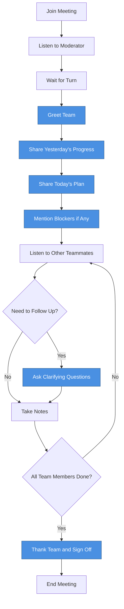

# Meeting Mind Flow 🎤💭

A comprehensive guide to effective communication in tech company meetings. This project provides structured speaking flows and natural expressions to help you communicate confidently and professionally in various meeting scenarios.

## 📋 Overview

Meeting Mind Flow is a practical resource for software engineers and tech professionals who want to improve their communication skills in workplace meetings. It provides:

- **Visual flowcharts** showing the natural progression of communication in different meeting types
- **Ready-to-use expressions** for each step of the conversation
- **Natural, conversational language** that sounds professional yet approachable

## 🎯 What's Inside

### Meeting Types Covered

1. **Daily Stand-up Meeting** (Attendee)
2. **Weekly Stand-up Meeting** (Attendee)
3. **Knowledge Sharing Meeting** (Facilitator/Chair)
4. **Technical Meeting / Code Review** (Presenter/Communicator)


## 🚀 How to Run

This project includes an automated script to generate customized coordinator documents based on your job role, experience, and company.

### Prerequisites
- Python 3.10 or higher
- [GitHub Copilot CLI](https://docs.github.com/en/copilot/concepts/agents/about-copilot-cli)

### Quick Start

1. **Clone the repository:**
   ```bash
   git clone <repository-url>
   cd Efficient-communication-at-workplace
   ```

2. **Run the automation script:**
   ```bash
   chmod +x run.sh
   ./run.sh --job "Software Engineer" --yoe 5 --company "Google"
   ```

3. **Customize with different parameters:**
   ```bash
   # Specify AI model (default: claude-sonnet-4.5)
   ./run.sh --model "claude-sonnet-4" --job "Machine Learning Engineer" --yoe 3 --company "OpenAI"
   
   # Use different job titles (underscores or dashes work)
   ./run.sh --job "Senior Data Scientist" --yoe 8 --company "Meta"
   ```

## 📖 How to Use the Resources

### For Visual Learners
1. Open `examples/task-stage-1-output.md` to view the Mermaid flowcharts
2. Follow the flow diagram for your meeting type
3. Use the color-coded nodes to understand decision points and actions

### For Expression Reference
1. Open `examples/task-stage-2-output.md` to browse ready-to-use expressions
2. Find your meeting type and specific speaking step
3. Choose an expression that fits your situation and personal style

## 💡 Key Features

### Natural & Conversational
All expressions are designed to sound like real tech professionals speaking, not corporate robots:
- Uses contractions and natural fillers
- Includes thought processes ("I think...", "Maybe...")
- Balances professionalism with approachability

### Versatile Options
Each speaking step includes 5 different expressions, giving you:
- Flexibility to match your personal style
- Options for different contexts and moods
- Variety to avoid sounding repetitive

## 📊 Example: Daily Stand-up Meeting

Here's a complete example showing both the communication flow and ready-to-use expressions for a daily stand-up meeting.

### Flow Diagram



### Sample Expressions

#### Case 1: Daily Stand-up Meeting (Attendee Role)

##### Greet Team

1. "Hey everyone, good morning!"
2. "Morning team!"
3. "Hey folks, hope everyone's doing well today."
4. "Good morning all!"
5. "Hey team, thanks for joining."

##### Share Yesterday's Progress

1. "So yesterday I wrapped up the CI/CD pipeline migration for the staging environment. Got everything tested and deployed."
2. "Yesterday was pretty productive - I finished up the monitoring dashboard refactoring and deployed it to production."
3. "I spent most of yesterday debugging the deployment issues we had with the Kubernetes cluster. Got that sorted out and everything's running smoothly now."
4. "Yesterday I knocked out the ticket for automating the backup scripts. Also did a quick review on Sarah's PR for the infrastructure changes."
5. "I made good progress on the Terraform modules yesterday. Got through about 70% of the refactoring work."

##### Share Today's Plan

1. "Today I'm planning to start on the load balancer configuration for the new microservice and hopefully get that done by end of day."
2. "For today, I'll be focusing on the security audit follow-ups. Want to get those critical findings addressed first."
3. "I'm going to continue with the database migration prep work today, and I also have that meeting with the security team this afternoon."
4. "Today's all about getting the monitoring alerts fine-tuned. I've been getting too many false positives, so want to clean that up."
5. "I'll be working on the Docker image optimization today. Also want to pair with Mike on the networking issue if he has time."

##### Mention Blockers if Any

1. "No blockers on my end."
2. "Everything's good here, no blockers."
3. "I do have one blocker actually - I'm waiting on the security team to approve those firewall rule changes before I can proceed with the deployment."
4. "Just a heads up, I'm a bit blocked on the API integration. Need access to the production credentials, so if someone from the platform team could help me out with that, that'd be great."
5. "All good here, though I might need some input from the architecture team later this week on the scaling strategy."

##### Ask Clarifying Questions

1. "Hey Sarah, just a quick question on what you mentioned - are you saying the issue is happening in all environments or just production?"
2. "Mike, when you say you're refactoring the auth service, does that impact the endpoints we're currently using, or is it all backward compatible?"
3. "Quick follow-up on that - do we need to coordinate our deployments, or can I go ahead with mine independently?"
4. "Just to clarify, is that something we need to prioritize this week, or can it wait until next sprint?"
5. "That sounds interesting - could you drop a link to that doc in the chat? I'd like to take a look."

##### Thank Team and Sign Off

1. "Alright, sounds good everyone. Thanks, and have a great day!"
2. "Cool, thanks team. Catch you all later!"
3. "Perfect, appreciate the updates everyone. Have a good one!"
4. "Great, thanks all. See you tomorrow!"
5. "Awesome, thanks everyone. Let me know if you need anything from me."


**💡 Tip:** Mix and match expressions to find your natural speaking style. The goal is to sound professional yet conversational!

For more meeting types and complete expression lists, check out the `examples/` folder.


## 🎓 Communication Tips

1. **Be Concise**: Respect everyone's time
2. **Be Prepared**: Know what you want to say before speaking
3. **Be Clear**: Use simple language, avoid unnecessary jargon
4. **Be Engaged**: Listen actively to others
5. **Be Positive**: Maintain a constructive tone
6. **Follow Up**: Always close the loop on action items


## 📝 Use Cases

This resource is perfect for:
- ✅ New engineers joining a tech company
- ✅ Non-native English speakers improving workplace communication
- ✅ Anyone who feels nervous speaking in meetings
- ✅ Team leads facilitating meetings
- ✅ Engineers presenting technical solutions
- ✅ Anyone wanting to sound more natural and confident

## 🤝 Contributing

Contributions are welcome! If you have:
- Additional meeting types to cover
- Better expressions or phrases
- Real-world examples that worked well
- Improvements to the flows

Feel free to open an issue or submit a pull request.

## 🙏 Acknowledgments

- Inspired by real meeting transcripts from tech professionals
- Designed for the global tech community
- Built to help engineers communicate with confidence

## 📬 Contact

Have questions or suggestions? Feel free to open an issue on GitHub.

---

**Remember**: The goal isn't to memorize scripts, but to internalize natural communication patterns. Use these as guides, adapt them to your style, and with practice, confident communication will become second nature! 🚀

---