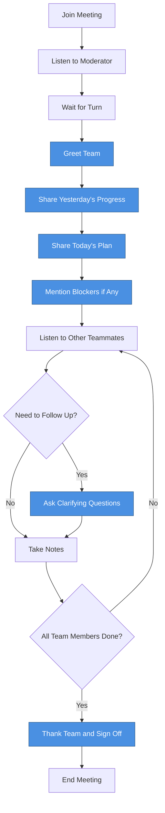
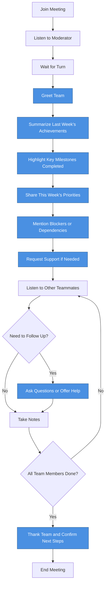
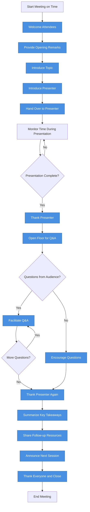

# Stage 1 Output: Mermaid Diagrams for Speaking Flow

This document contains Mermaid diagrams demonstrating the speaking flow for various meeting types. Blue nodes represent action steps where the speaker needs to communicate.

---

## Case 1: Daily Stand-up Meeting (Attendee Role)

---

## Case 2: Weekly Stand-up Meeting (Attendee Role)

---

## Case 3: Knowledge Sharing Meeting (Facilitator Role)

---

## Case 4: Technical Meeting / Code Review (Communicator/Presenter Role)

```mermaid
graph TD
    A[Join Meeting] --> B[Greet Attendees]
    B --> C[Set Context and Agenda]
    C --> D[Explain Background of Technical Issue]
    D --> E[Describe Current State]
    E --> F[Identify Problem or Challenge]
    F --> G[Present Proposed Solution]
    G --> H[Walk Through Technical Details]
    H --> I[Explain Trade-offs and Alternatives]
    I --> J[Share Implementation Plan]
    J --> K[Invite Questions and Feedback]
    K --> L{Questions or Concerns?}
    L -->|Yes| M[Address Questions]
    M --> N{More Questions?}
    N -->|Yes| M
    N -->|No| O[Acknowledge Feedback]
    L -->|No| O
    O --> P[Discuss and Align on Next Steps]
    P --> Q[Assign Action Items]
    Q --> R[Confirm Timeline]
    R --> S[Thank Participants]
    S --> T[End Meeting]
    
    style B fill:#4A90E2,stroke:#2E5C8A,color:#fff
    style C fill:#4A90E2,stroke:#2E5C8A,color:#fff
    style D fill:#4A90E2,stroke:#2E5C8A,color:#fff
    style E fill:#4A90E2,stroke:#2E5C8A,color:#fff
    style F fill:#4A90E2,stroke:#2E5C8A,color:#fff
    style G fill:#4A90E2,stroke:#2E5C8A,color:#fff
    style H fill:#4A90E2,stroke:#2E5C8A,color:#fff
    style I fill:#4A90E2,stroke:#2E5C8A,color:#fff
    style J fill:#4A90E2,stroke:#2E5C8A,color:#fff
    style K fill:#4A90E2,stroke:#2E5C8A,color:#fff
    style M fill:#4A90E2,stroke:#2E5C8A,color:#fff
    style O fill:#4A90E2,stroke:#2E5C8A,color:#fff
    style P fill:#4A90E2,stroke:#2E5C8A,color:#fff
    style Q fill:#4A90E2,stroke:#2E5C8A,color:#fff
    style R fill:#4A90E2,stroke:#2E5C8A,color:#fff
    style S fill:#4A90E2,stroke:#2E5C8A,color:#fff
```

---

## Summary

These Mermaid diagrams provide reusable speaking flows tailored for a DevOps Engineer at Google with 5 years of experience. Each diagram:
- Uses blue nodes to highlight communication action steps
- Follows natural communication patterns used in tech companies
- Provides a structured yet flexible framework for effective workplace communication
- Adapts to different meeting types and speaker roles
