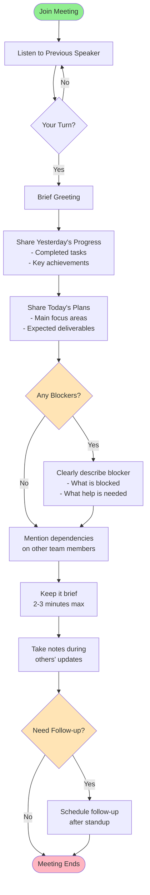

# Meeting Speaking Flow Diagrams

This folder contains Mermaid flowcharts for effective communication patterns in various meeting types within a tech company.

## Files
## How to Use

### Viewing Diagrams
- Open any `.mmd` file in VS Code
- Use the Mermaid preview extension to visualize the flowchart
- Each diagram shows a complete speaking flow for that meeting type

### Color Legend
- 🟢 **Green nodes**: Start of the flow
- 🩷 **Pink nodes**: End of the flow
- 🟡 **Yellow nodes**: Decision points requiring your judgment
- 🔵 **Blue nodes**: Regular action steps

## Tips for Success

1. **Be concise**: Respect everyone's time
2. **Be prepared**: Know what you want to say before the meeting
3. **Be clear**: Use simple language and avoid jargon when possible
4. **Be engaged**: Listen actively to others
5. **Be positive**: Maintain a constructive tone
6. **Follow up**: Always close the loop on action items

## Meeting Types Covered

### Case 1: Daily Stand-up Meeting
**Role:** Attendee  
**Duration:** 2-3 minutes per person  
**Focus:** Yesterday's work, today's plans, blockers

### Case 2: Weekly Stand-up Meeting
**Role:** Attendee  
**Duration:** 3-5 minutes per person  
**Focus:** Last week's achievements, this week's goals, learnings

### Case 3: Knowledge Sharing Meeting
**Role:** Facilitator/Chair  
**Duration:** 30-60 minutes  
**Focus:** Introducing presenter, managing Q&A, time management

### Case 4: Technical Meeting / Code Review
**Role:** Communicator/Presenter  
**Duration:** 15-45 minutes  
**Focus:** Context, solution presentation, feedback gathering

---

**Note:** These flows are designed for tech company environments and can be adapted to your specific team culture and needs.

---

## Case 1: Daily Stand-up Meeting (Attendee)

- Daily Stand-up Meeting (Attendee)
   - Natural flow for sharing progress, plans, and blockers
   - Emphasizes brevity (2-3 minutes)
   - Includes decision points for blockers and follow-ups

---

## Case 2: Weekly Stand-up Meeting (Attendee)
- Weekly Stand-up Meeting (Attendee)
   - Extended version of daily standup with weekly perspective
   - Includes sections for key learnings and insights
   - Covers cross-team dependencies and risk management

```mermaid
flowchart TD
    Start(["Join Weekly Meeting"]) --> Listen["Listen to Previous Speaker"]
    Listen --> YourTurn{"Your Turn?"}
    YourTurn -->|No| Listen
    YourTurn -->|Yes| Greet["Brief Greeting"]
    Greet --> LastWeek["Share Last Week's Progress<br/>- Major accomplishments<br/>- Completed features/tasks<br/>- Key metrics if applicable"]
    LastWeek --> ThisWeek["Share This Week's Plans<br/>- Main objectives<br/>- Expected deliverables<br/>- Timeline for tasks"]
    ThisWeek --> Blockers{"Any Blockers<br/>or Risks?"}
    Blockers -->|Yes| ShareBlockers["Describe blocker/risk<br/>- Impact on timeline<br/>- Support needed"]
    Blockers -->|No| CrossTeam["Mention cross-team<br/>dependencies"]
    ShareBlockers --> CrossTeam
    CrossTeam --> Learnings{"Key Learnings<br/>to Share?"}
    Learnings -->|Yes| ShareLearnings["Share insights<br/>- Technical discoveries<br/>- Process improvements"]
    Learnings -->|No| Summarize["Summarize key points<br/>3-5 minutes max"]
    ShareLearnings --> Summarize
    Summarize --> TakeNotes["Take notes during<br/>others' updates"]
    TakeNotes --> NeedFollowup{"Need Follow-up?"}
    NeedFollowup -->|Yes| Followup["Schedule follow-up<br/>meetings or discussions"]
    NeedFollowup -->|No| End(["Meeting Ends"])
    Followup --> End
    
    style Start fill:#90EE90
    style End fill:#FFB6C1
    style Blockers fill:#FFE4B5
    style Learnings fill:#FFE4B5
    style NeedFollowup fill:#FFE4B5
```

---

## Case 3: Knowledge Sharing Meeting (Facilitator)
- Knowledge Sharing Meeting (Facilitator)
   - Complete facilitator workflow from preparation to closing
   - Includes time management and Q&A facilitation
   - Emphasizes creating a welcoming environment

```mermaid
flowchart TD
    Start(["5 Minutes Before Meeting"]) --> Prepare["Check setup<br/>- Presenter ready?<br/>- Screen sharing works?<br/>- Recording ready?"]
    Prepare --> MeetingStart["Start Meeting on Time"]
    MeetingStart --> Welcome["Welcome Everyone<br/>- Warm greeting<br/>- Thank attendees for joining"]
    Welcome --> Housekeeping["Brief Housekeeping<br/>- Meeting duration<br/>- Q&A format<br/>- Recording notice"]
    Housekeeping --> IntroPresenter["Introduce Presenter<br/>- Name and role<br/>- Relevant background<br/>- Why this topic matters"]
    IntroPresenter --> IntroTopic["Introduce Topic<br/>- Brief overview<br/>- What attendees will learn<br/>- Set expectations"]
    IntroTopic --> HandOver["Hand over to Presenter<br/>with enthusiasm"]
    HandOver --> Monitor["Monitor Session<br/>- Watch time<br/>- Track chat questions<br/>- Note engagement"]
    Monitor --> TimeCheck{"Time for Q&A?"}
    TimeCheck -->|Yes| ManageQA["Facilitate Q&A<br/>- Read chat questions<br/>- Encourage participation<br/>- Keep discussions on track"]
    TimeCheck -->|No| Monitor
    ManageQA --> TimeWarning{"5 Min<br/>Remaining?"}
    TimeWarning -->|Yes| WrapUp["Signal wrap-up time<br/>to presenter"]
    TimeWarning -->|No| ManageQA
    WrapUp --> ThankPresenter["Thank Presenter<br/>- Highlight key takeaways<br/>- Appreciate their time"]
    ThankPresenter --> ShareResources["Share Resources<br/>- Recording link<br/>- Slides/materials<br/>- Follow-up contacts"]
    ShareResources --> ThankAttendees["Thank Attendees<br/>- Encourage feedback<br/>- Preview next session"]
    ThankAttendees --> End(["Close Meeting"])
    
    style Start fill:#90EE90
    style End fill:#FFB6C1
    style TimeCheck fill:#FFE4B5
    style TimeWarning fill:#FFE4B5
```

---

## Case 4: Technical Meeting / Code Review (Communicator)
- Technical Meeting / Code Review (Communicator)
   - Structured approach for technical discussions
   - Covers context setting, solution presentation, and feedback collection
   - Emphasizes active listening and clear next steps

```mermaid
flowchart TD
    Start(["Initiate Meeting"]) --> Greet["Greet Colleagues<br/>Thank them for joining"]
    Greet --> SetContext["Set Context<br/>- What system/feature<br/>- Why this review is needed<br/>- Scope of discussion"]
    SetContext --> Background["Provide Background<br/>- Current situation<br/>- Problem discovered<br/>- Impact on users/system"]
    Background --> ShowCode{"Show Code?"}
    ShowCode -->|Yes| ShareScreen["Share screen<br/>Walk through code"]
    ShowCode -->|No| Explain["Explain technical details<br/>- Architecture<br/>- Components involved"]
    ShareScreen --> Explain
    Explain --> Solution["Present Solution<br/>- Proposed approach<br/>- Why this solution<br/>- Alternatives considered"]
    Solution --> ShowImplementation["Show Implementation<br/>- Key code changes<br/>- Test coverage<br/>- Performance considerations"]
    ShowImplementation --> TradeOffs["Discuss Trade-offs<br/>- Pros and cons<br/>- Risks identified<br/>- Mitigation strategies"]
    TradeOffs --> AskFeedback["Ask for Feedback<br/>- Open the floor<br/>- Specific questions<br/>- Concerns?"]
    AskFeedback --> Listen["Listen Actively<br/>- Take notes<br/>- Acknowledge points<br/>- Ask clarifying questions"]
    Listen --> MoreFeedback{"More<br/>Feedback?"}
    MoreFeedback -->|Yes| Listen
    MoreFeedback -->|No| Summarize["Summarize Discussion<br/>- Key feedback received<br/>- Action items<br/>- Decisions made"]
    Summarize --> NextSteps["Define Next Steps<br/>- Who does what<br/>- Timeline<br/>- Follow-up meeting if needed"]
    NextSteps --> Document["Mention Documentation<br/>- Meeting notes<br/>- Code review comments<br/>- Ticket updates"]
    Document --> Thank["Thank Colleagues<br/>for their input<br/>and time"]
    Thank --> End(["Close Meeting"])
    
    style Start fill:#90EE90
    style End fill:#FFB6C1
    style ShowCode fill:#FFE4B5
    style MoreFeedback fill:#FFE4B5
```

