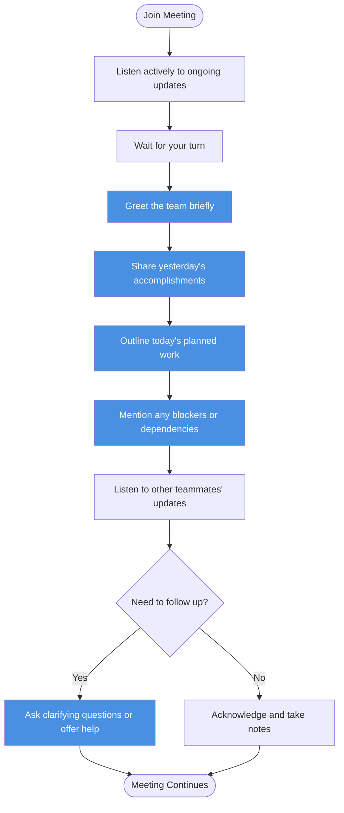
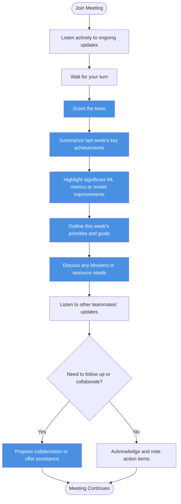
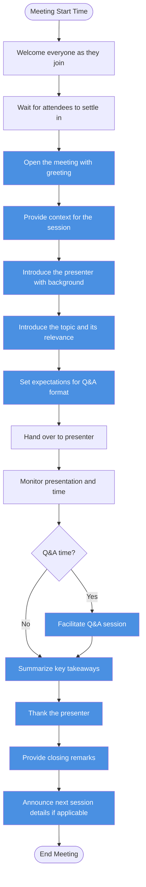
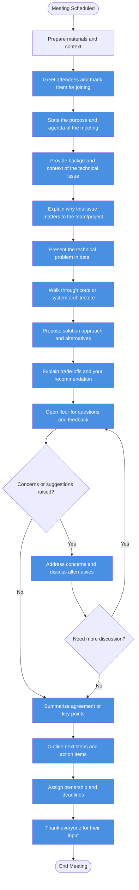

# Stage 1 Output: Speaking Flow Diagrams

This document contains Mermaid diagrams demonstrating the speaking flow for different meeting types tailored for an ML Engineer with 5 years of experience at Google.

## Case 1: Daily Stand-up Meeting (Attendee)

## Case 2: Weekly Stand-up Meeting (Attendee)

## Case 3: Knowledge Sharing Meeting (Facilitator)

## Case 4: Technical Meeting / Code Review (Presenter/Communicator)

