# Stage 1 Output: Mermaid Diagrams for Speaking Flow

This document contains Mermaid diagrams demonstrating the speaking flow for each type of meeting.

**Legend:**
- 🔵 Blue nodes = Action steps where the speaker needs to communicate
- ⚪ Other nodes = Internal thoughts, decisions, or passive actions

---

## Case 1: Daily Stand-up Meeting
**Role:** Attendee  
**Scenario:** Join every morning to catch up with the team

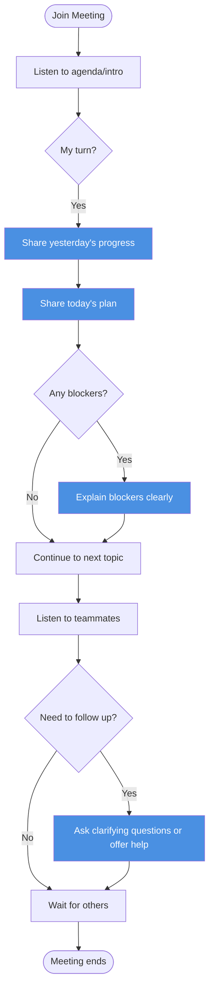

---

## Case 2: Weekly Stand-up Meeting
**Role:** Attendee  
**Scenario:** Join every week to catch up with the team

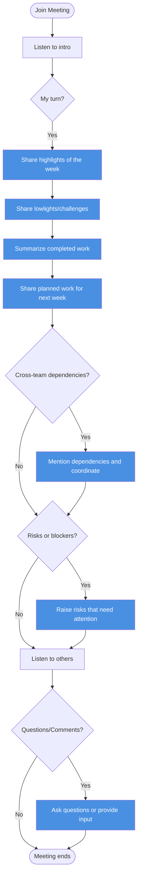

---

## Case 3: Knowledge Sharing Meeting
**Role:** Facilitator  
**Scenario:** Chair the meeting where a presenter shares a topic

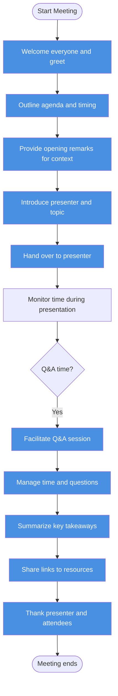

---

## Case 4: Technical Meeting / Code Review
**Role:** Communicator/Presenter  
**Scenario:** Discuss technical issue or present code for review

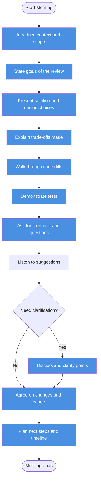

---

## Case 5: Sprint Planning
**Role:** Product Owner/Facilitator  
**Scenario:** Plan work for the upcoming sprint

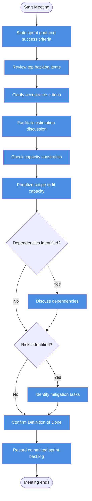

---

## Case 6: Sprint Review / Demo
**Role:** Presenter  
**Scenario:** Demonstrate completed work to stakeholders

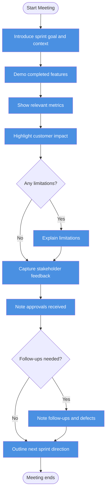

---

## Case 7: Retrospective
**Role:** Facilitator  
**Scenario:** Team reflects on the last sprint to improve

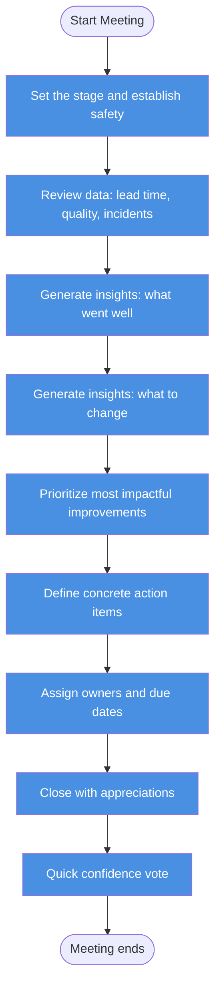

---

## Case 8: Project Kickoff
**Role:** Project Lead/Facilitator  
**Scenario:** Starting a new project with cross-functional team

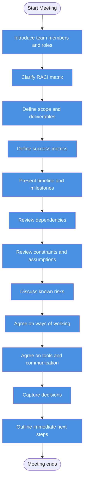

---

## Case 10: Architecture Design Review
**Role:** Tech Lead/Architect  
**Scenario:** Significant design requires peer and governance review

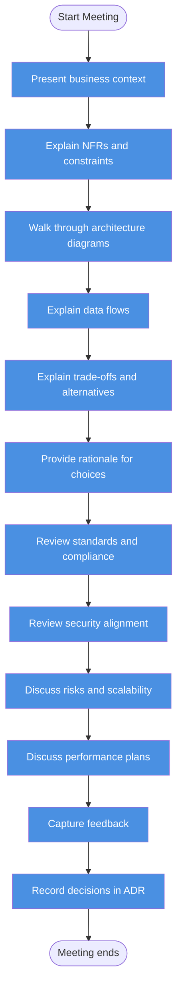

---

## Case 11: Incident Postmortem / Root Cause Analysis (RCA)
**Role:** Incident Lead  
**Scenario:** Analyze causes and fixes after a major incident

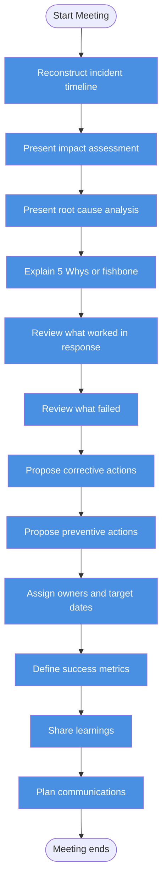

---

## Case 15: Cross-Team Sync / Alignment
**Role:** Coordinator  
**Scenario:** Multiple teams align on dependencies and plans

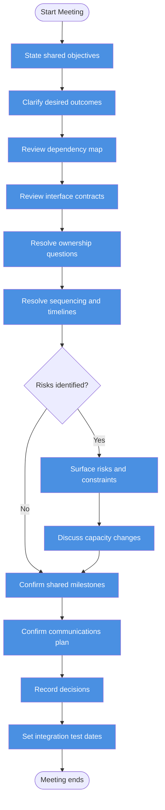

---

## Case 21: Training Workshop / Enablement
**Role:** Trainer/Facilitator  
**Scenario:** Upskill the team on a tool, process, or skill

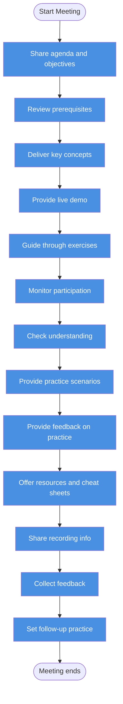

---

## Case 26: Go/No-Go Release Readiness
**Role:** Release Manager  
**Scenario:** Decide whether to proceed with a launch/deployment

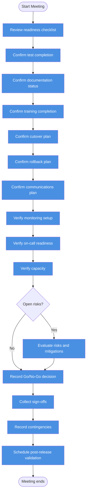

---

**End of Stage 1 Output**
